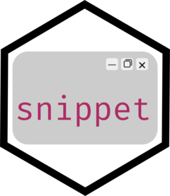
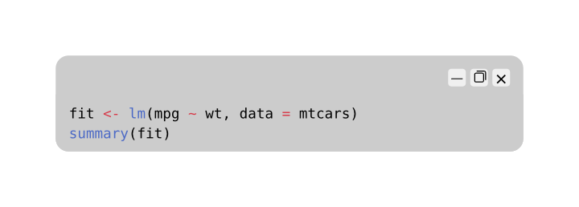
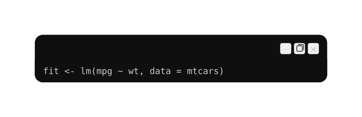
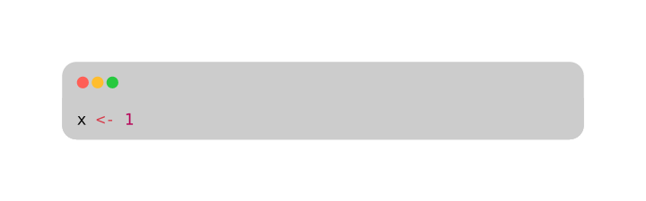
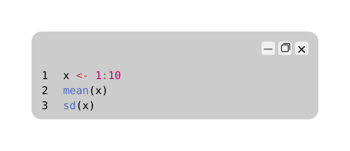

<!-- README.md is generated from README.Rmd. Please edit that file -->

# snippet <a href="https://christopherkenny.github.io/snippet/"></a>

<!-- badges: start -->

<!-- badges: end -->

`snippet` creates shareable, syntax-highlighted code images directly
from your R session. It uses [Typst](https://typst.app) for rendering,
which can create `png`, `pdf`, or `svg` outputs.

## Installation

Install the development version from
[GitHub](https://github.com/christopherkenny/snippet):

``` r
pak::pak('christopherkenny/snippet')
```

`snippet` also requires [Typst](https://typst.app) to be installed on
your system. If you have Quarto installed, it will use its bundled Typst
as a fallback. See [typr](https://christophertkenny.com/typr/) for more
details on the fallback strategy.

## Usage

Pass code as a string, a character vector, or a file path. Leave `code`
empty to use your clipboard:

``` r
library(snippet)

snippet('fit <- lm(mpg ~ wt, data = mtcars)\nsummary(fit)')
```



### Themes

Two [Flexoki](https://stephango.com/flexoki) themes are bundled. List
available themes with `snippet_themes()`:

``` r
snippet(
  'fit <- lm(mpg ~ wt, data = mtcars)',
  theme = 'Flexoki Dark'
)
```



Install additional themes by name with `snippet_install_theme()`. See
the full list with `snippet_known_themes()`:

``` r
snippet_install_theme('Dracula')
snippet_install_theme('Tomorrow Night')

snippet('fit <- lm(mpg ~ wt, data = mtcars)', theme = 'Dracula')
```

You can also install any theme from a URL or local file path:

``` r
snippet_install_theme('https://example.com/my-theme.tmTheme')
snippet_install_theme('/path/to/my-theme.tmTheme')
```

### Window styles

The package supports Windows (default) and Mac browser controls.

``` r
snippet('x <- 1', style = 'mac')
```



### Line numbers and width

``` r
snippet(
  'x <- 1:10\nmean(x)\nsd(x)',
  line_numbers = TRUE,
  width = 4
)
```


